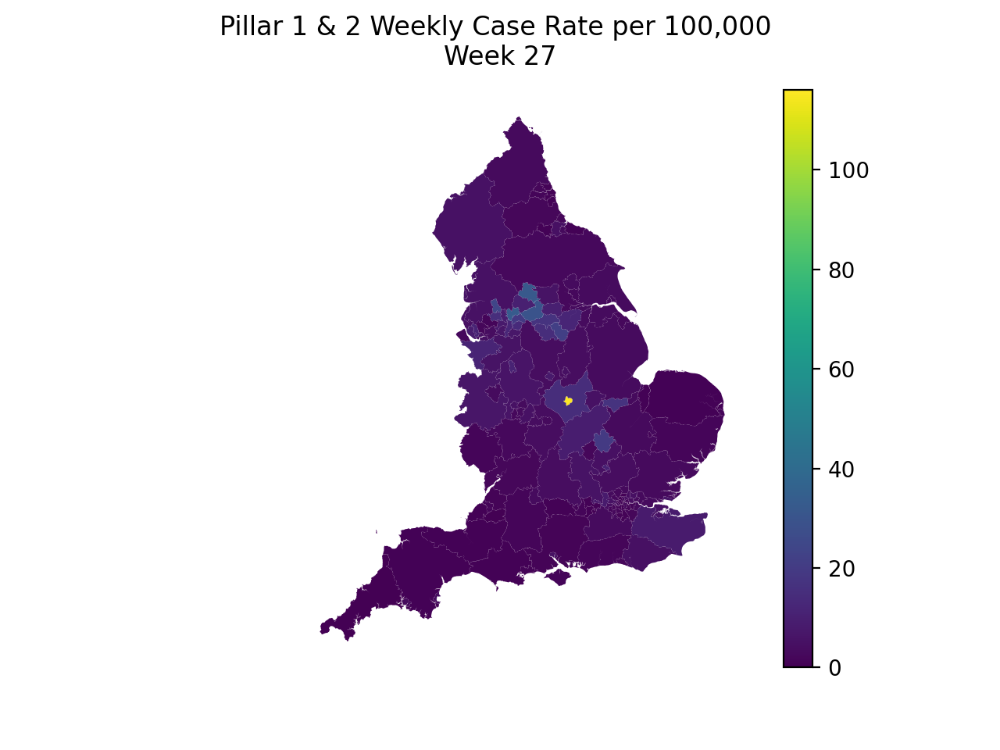

# cv19-uk-data
This GitHub site contains Covid data for England as published by the 
UK Government [here](https://www.gov.uk/government/publications/national-covid-19-surveillance-reports). 

Each week we took the Excel format files and converted to more useful formats (CSV, JSON and GeoJson) and published them here. 
The UK government stopped publishing data to the 
site after week 40 (which related to data collected for Week 39, ie. between 21 August and 27 September 2020).

